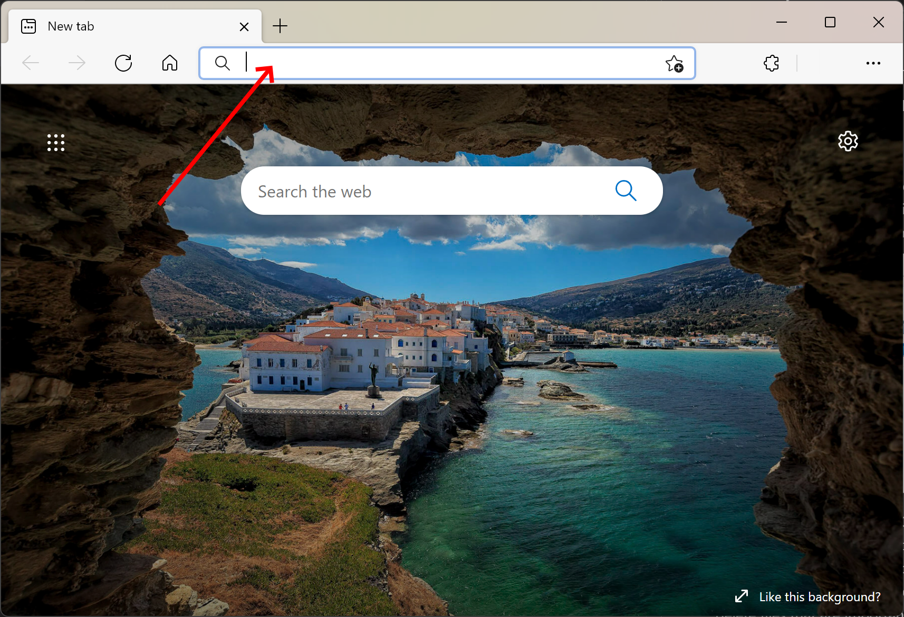
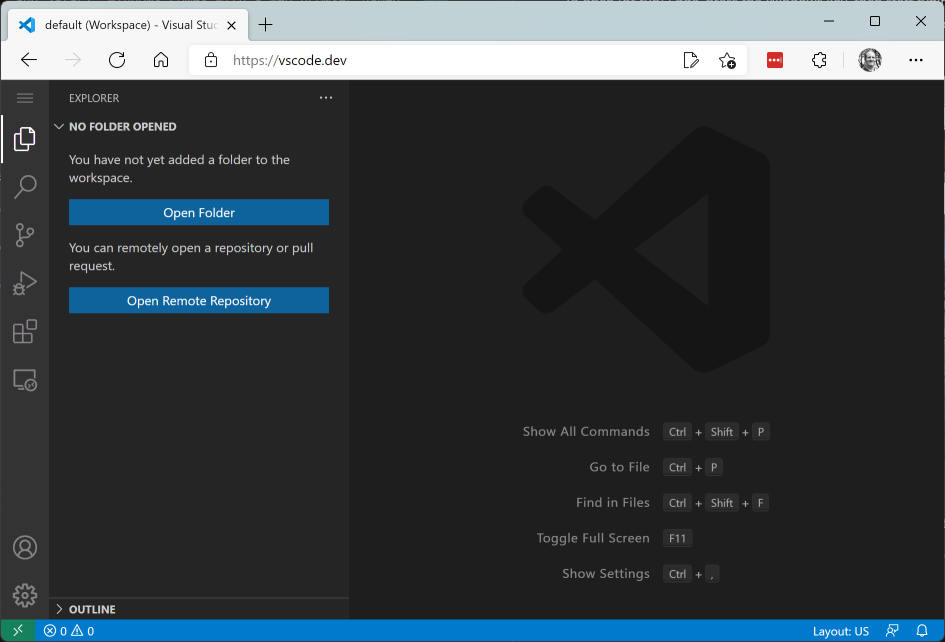

# Launching Applications

Applications are programs your computer runs. Your computer can run all kinds of programs. Some examples include video games, music players, and web browsers.

For these katas we're going to be running some programs commonly used in computer programming.

## File Explorer
The first program we are going to use is called File Explorer. Your computer is full of files. These files are organized into groups called folders or directories. Every program you run on your computer, every document you edit and save on your computer, and every picture you view on your computer is a file.

File Explorer is a special program on your computer that comes with Windows. It lets you view all the files and folders on your computer.

To open (or run) File Explorer, press the Windows key on your keyboard, then start typing `File Explorer`. File Explorer should come up in the search results. Click on it.

A File Explorer window should open. It should look something like this (though it might look a little different if you are using a different version of Windows than I am).

Double click on "Local Disk (C:)". Doing this will show you almost all the files stored on your computer. (By default Windows will hide some files from you, but we don't need to worry about those files right now.) You do need to be a little careful so you don't move or delete files that are important to you or that are important for your computer to work properly.

## Web Browser
A web browser is a program that lets your computer talk to other computers. Web browsers mostly talk to other computers by asking them for web pages. This usually happens over the internet, but can happen in other ways too.

There are many different web browsers. Some common ones are named Chrome, Firefox, and Safari. Windows comes with a web browser named Edge.

To open (or run) Edge, press the Windows key, then start typing `Edge`. A program named "Microsoft Edge" should come up in the search results. Click on it.

When Edge opens, it should look something like this.

The area the red arrow is pointing at is called the address bar. This is how you tell the web browser (sometimes just called a browser) which othe computer you would like to talk to.

Click on the address bar and type in `vscode.dev`. Then press enter. This tells your web browser to look for a computer named `vscode.dev` and ask it for a web page. Assuming your browser is able to to all that, the result should look something like this.

## Windows Terminal
Windows Terminal is a program that lets you run commands and other programs by typing their names. To open it, press the Windows key, then start typing `Terminal`. Windows Terminal should come up in the search results. Click it.

When Windows Terminal opens, it should look something like this.

Type the command `ls` and press enter. Windows Terminal should show a list of files. Those are the files that are in the directory (or folder) than Windows Terminal is currently set to look in.

We'll learn more about Windows Terminal in a future kata.

## Your Assignment
To show that you have completed this kata, you should

* Open File Explorer. Find your Documents folder and see what files are in that folder.
* Open your web browser (Edge). Navigate to `vscode.dev`.
* Open Windows Terminal. Run the `ls` command.

For each of these tasks you should take a screenshot to show that you have completed it. If you need help taking a screenshot and knowing where to send it, ask for help from a parent or whoever is helping you with these katas.