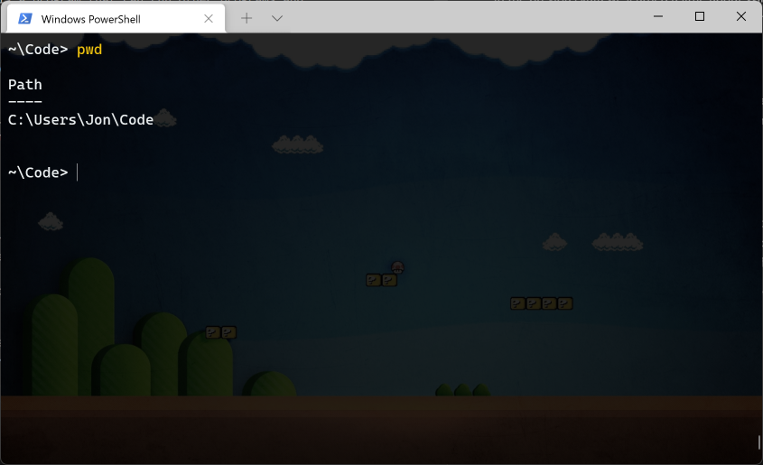
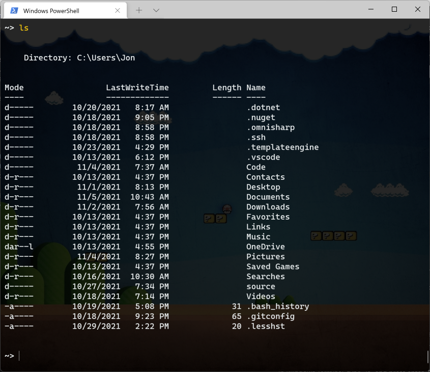
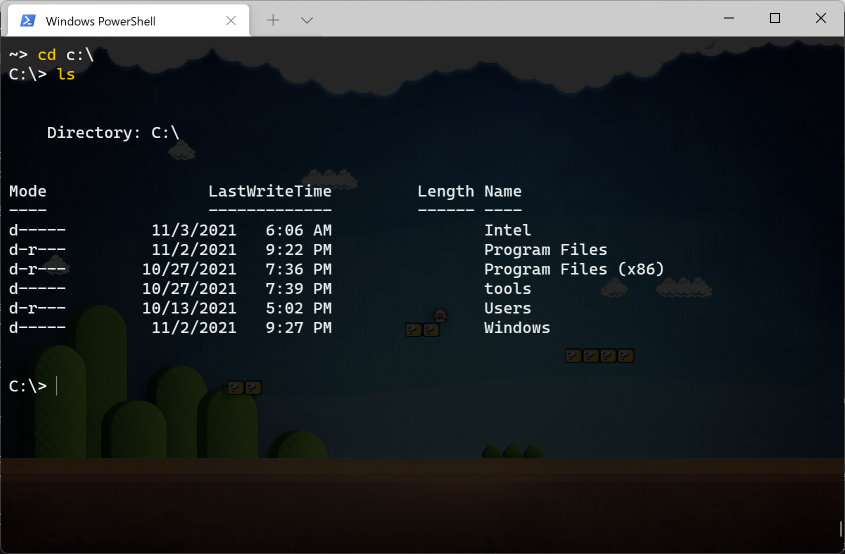
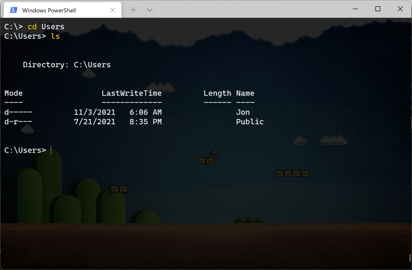
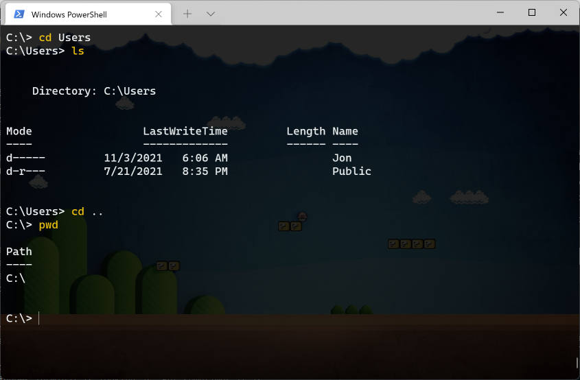
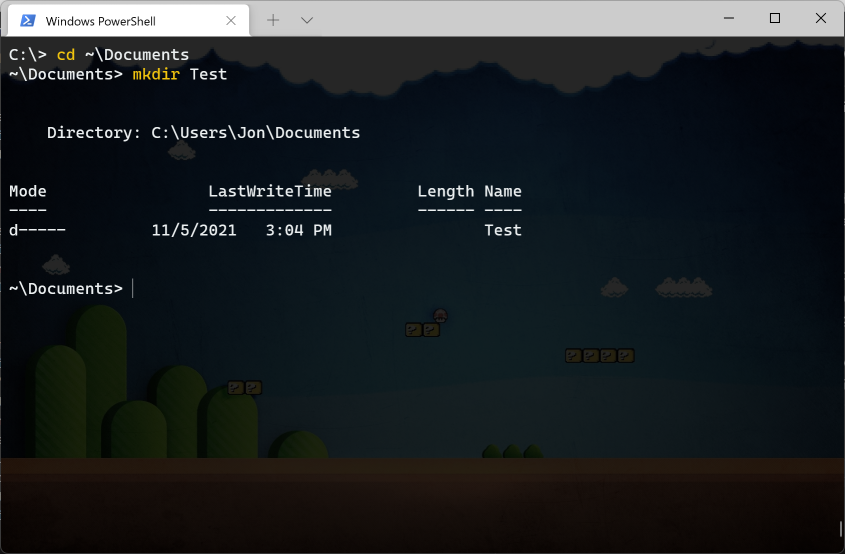
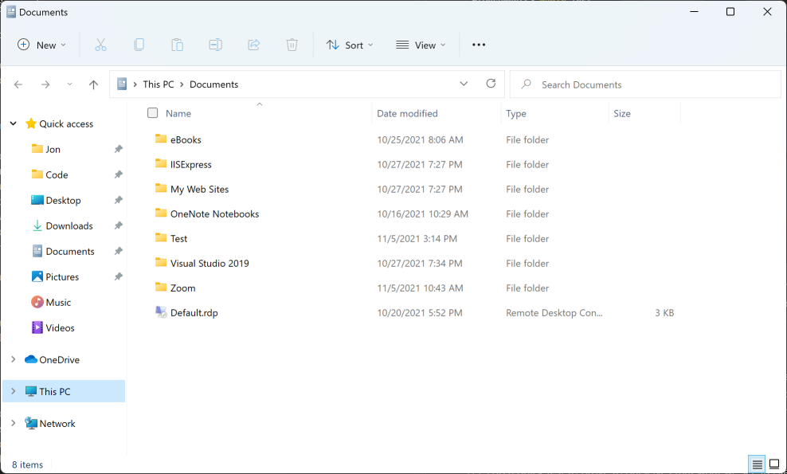
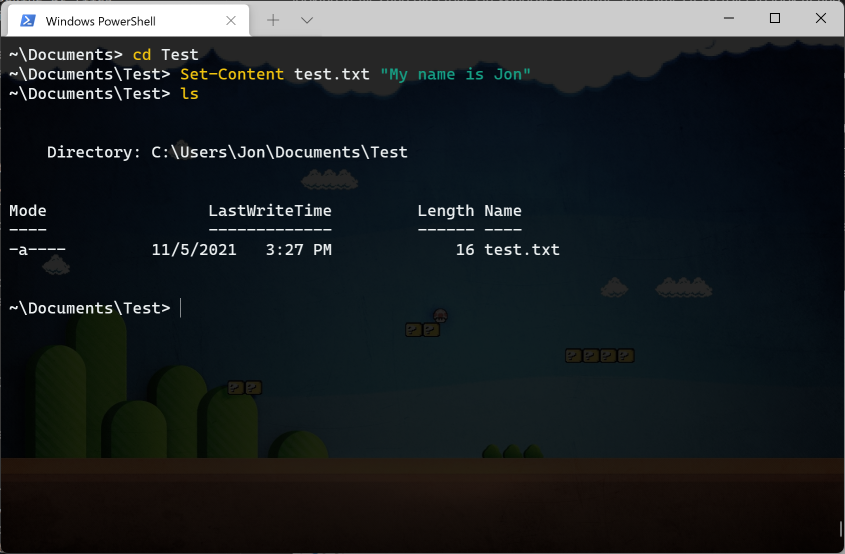
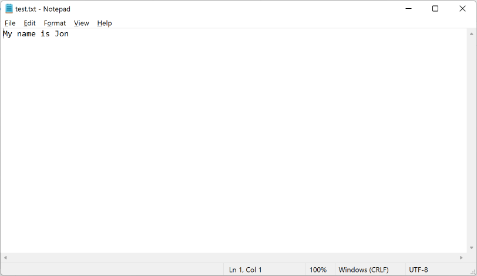
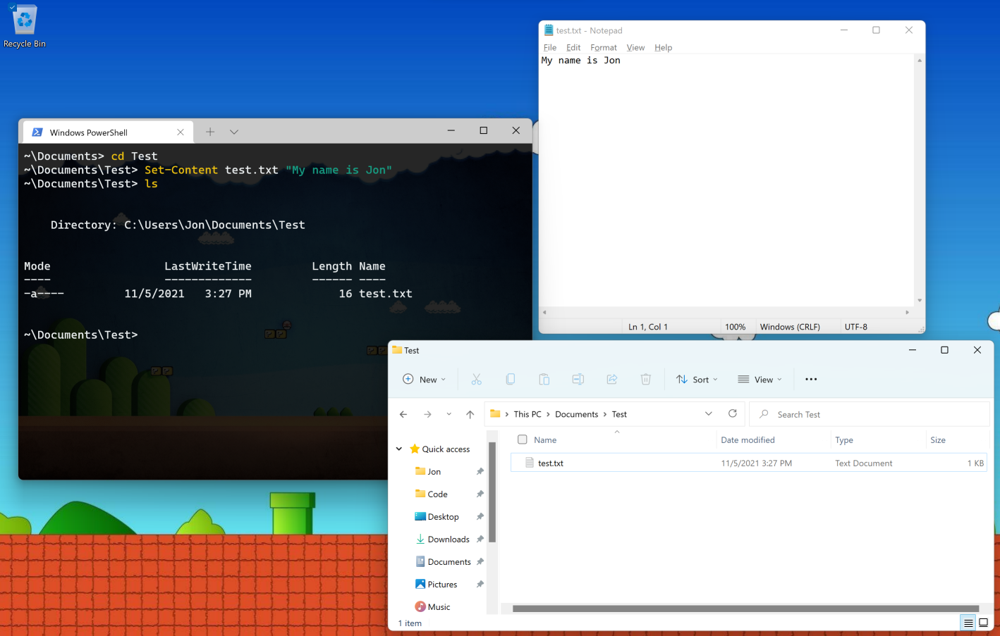

# Command Line

In the previous kata we learned a little about Windows Terminal. Windows Terminal is a program that can run other programs and commands. In this kata we're going to learn more about Windows Terminal.

## Starting Windows Terminal

As a reminder, to start (or run) Windows Terminal, press the the Windows key on your keyboard. Start typing `Terminal`. A program named "Windows Terminal" should show up in the search results. Click it.

## PWD

The first command we will learn aboug is `pwd`. In the previous kata we learned about how your computer is full of files. And those files are in groups named folders or directories. Windows Terminal is always looking at one of these directories. You can change what directory it is looking at, but it will always be looking at one of them.

In Windows Terminal, type `pwd` and press enter. The results should look something like this.

This command tells Windows Terminal to print out the name of the directory it is currently looking at. The command "pwd" is short for Print Working (meaning current) Directory.

If you're ever unsure about what directory Windows Terminal is currently looking at, you can always use the `pwd` command to find out.

## LS

Directories have files in them. They can also have other directories in them. You can find out what files and directories (sometimes called sub-directories) are in a directory using the `ls` command.

In Windows Terminal, type `ls` and press enter. The results should look something like this.

This is a list of all the files and directories that are in the directory Windows Terminal was looking at when I ran the `ls` command. In the Mode column, the entries that start with `d` are directories. The other entries are files.

The command "ls" is short for List, meaning to list files and directories.

## CD

As mentioned above, it's possible to change what directory Windows Terminal is looking at. You can use the `cd` command to change what directory Windows Terminal is looking at. The command "cd" is short for Change Directory.

For this command, you need to type the command and what directory you want Windows Terminal to change to (meaning what directory it is currently looking at). In Windows Terminal, type `cd c:\` and press enter. After you do that, type `ls` (like we learned up above) and press enter. The results should look something like this.

The first command tells Windows Terminal to change which directory it is looking at. "C:\\" means the top-most directory (sometimes called the root directory) of the drive named "C:". The second command tells Windows Terminal to list all the files and directories in that top-most directory. The list of files you have might look different than the list of files I have.

Next, in Windows Terminal type `cd Users` and press enter. Then type `ls` and press enter again. The results should look something like this.

The first command tells Windows Terminal to change what directory it is looking at. The `Users` directory is a special directory in Windows that contains a directory for every each user on the computer. Almost always, all of the files in your Documents folder, your Pictures folder, your Downloads folder, and on your Desktop live somewhere in a directory inside of the `Users` directory. Almost all of the files I use on the computer I'm using live inside the `Jon` directory inside the `Users` directory because "Jon" is the name of my user account on this computer.

You can always type `cd` and then the name of a directory to change which directory Windows Terminal is looking at. But sometimes it is helpful to be able to tell Windows Terminal to change to look at the directory that the currently directory is inside of. This is sometimes called going up one directory. Because this is used so often, there is a special short way to do this.

In Windows Terminal, type `cd ..` and press enter. Then type `pwd` and press enter. The results should look something like this.

The `Users` directory is inside the top-most or root directory. When Windows Terminal is looking at the `Users` directory and you tell it to go up to the containing directory by typing the `cd ..` command, Windows Terminal will switch back to looking at that top-most or root directory. This works for all other directories as well.

Fun fact: The `cd ..` command also works for the top-most directory, `C:\`. But because that is already the top-most directory, when you tell Windows Terminal to go up one directory, it just keeps looking at the same directory.

## MKDIR

In addition to listing directories and changing what directory Windows Terminal is looking at, you can also tell Windows Terminal to create directories. You can use the `mkdir` command to create new directories or folders. The command "mkdir" is short for Make Directory.

Like `cd`, with `mkdir` you need to type the name of the command and the name of the directory you want to create. In Windows Terminal, type the command `cd ~\Documents` and press enter. This tells Windows Terminal to change the directory it is looking at to your Documents directory. The character `~` (the name of this character is tilde) is a special character that means "the directory where everything for your user is located". This directory is sometimes called your home directory or user directory. When you type `~\Documents` that means "go to the directory where everything for the current user is stored, then go to the Documents directory inside it."

After telling Windows Terminal to look at your Documents directory, type `mkdir Test` and press enter. The results should look something like this.

This tells Windows Terminal to create a new directory (or folder) named "Test" inside your Documents folder. You can then use the `cd` command to tell Windows Terminal to look at that new "Test" directory. You could also put files or other directories in that directory.

## File Explorer Again

In the previous kata we learned about File Explorer and how it is a special program for looking at the files and directories on your computer. You may have noticed that we have been looking at files and directories in Windows Terminal. Sometimes it is easier to look at and work with files in File Explorer, and other times it is easier to look at and work with files in Windows Terminal. Regardless of how you look at them, they are the same files.

Let's do a quick test to prove to ourselves that what we see in File Explorer and what we see in Windows Terminal are the same files.

First, in Windows Terminal, type `cd ~\Documents` to make sure you are in your Documents directory. Then type `start .` and press enter (making sure you get the space and the period in there before you press enter). This should open a File Explorer window. It should be open to your Documents folder.

If you did not create a "Test" folder in the previous section about `mkdir`, do so now. In File Explorer, you should see a directory (or folder) named "Test" inside your Documents folder. It should look something like this.

Now, go back to Windows Terminal. Type the command `cd Test` and press enter to tell Windows Terminal to look inside the new directory you just created.

Now type `Set-Content test.txt "My name is Jon"` and press enter. But instead of "Jon", put your name. This command will tell Windows Terminal to make a new file named "test.txt" and to put the text "My name is Jon" (or whatever your name is) inside that file. To make sure the file got created, type `ls` and press enter. All those commands together should look something like this.

Windows Terminal now shows a file named "test.txt" inside the "Test" directory that we created earlier.

Now go back to File Explorer. Double click on the "Test" directory we created. Inside that directory you should see a file named "test.txt". That's the same file we created with Windows Terminal. Double click on the "test.txt" file. That should open the file in Notepad (but may open it in a different program, depending on how your computer is set up).

The file should like something like this.

That's the same thing we told Windows Terminal to put in the file! That's because it's the same file, just a different way to look at it.

## Your Assignment

Follow all the steps above in this kata. Once you have done that, take a screenshot of the following things.

* Windows Terminal where you used the `Set-Content` command to create your "test.txt" file.
* File Explorer showing your "test.txt" file.
* Notepad (or another program) showing the contents of your "test.txt" file (but with your name in it).

Again, if you need help taking a screenshot and sending it, please ask for help. You can send separate screenshots of the above items, or you can send one screenshot it all three things in it like this.

