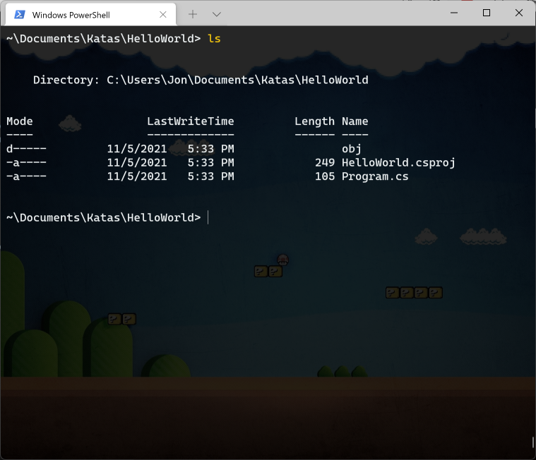

# Hello World

In the first two katas we didn't actually do any programming. In this kata we still start doing some programming. We will use a programming language called C# (prounced SEE SHARP).

We will create what is called a "Hello World" program. A "Hello World" program is one that prints a simple message to the screen. This type of program is great as a first step to make sure everything is working correctly.

## Create a Project

When using C# to create a program, you'll need one or more files that have C# code in them. These are just text files, but they have instructions for the computer to execute instead of English sentences. You will then run a program that looks at your text files and creates a program from them. The program that does this is called a compiler.

In addition to the text files that have C# code in them, you also need a project file. This is a file that has some special instructions for the compiler (the program that turns your code into a program) about how it should create your program.

Fortunately, with C# there is an easy way to create a project file and a C# file to get you started. First, open Windows Terminal. (If you don't remember how to do this, review the [first kata](kata-1.md).) We'll put all of the programs we write for these katas into a directory so they're easy to find. To create that directory, start by typing `cd ~\Documents` and press enter. Remember that the `cd` command changes what directory Windows Terminal is looking at. Once Windows Terminal is looking at your Documents directory, type `mkdir Katas` to create a new directory named "Katas". All of the code we write will go in this directory. 

But it would get very messy if we started putting too many things in this one directory, so let's make a directory inside the "Katas" directory for this Hello World kata. Type `cd Katas` to change what directory Windows Terminal is looking at. Then type `mkdir HelloWorld` (with no space between Hello and World. You can have spaces in directory names, but they're harder to type that way) and press enter. Finally, type `cd HelloWorld` to change the current directory one more time.

All of those commands should look something like this.

Now that we have all that done, we finally have a place for our code to live. Again in Windows Terminal, type `dotnet new console` and press enter. The output from running that command should look something like this.

Your output might look slightly different, especially if this is your first time running the command.

Let's see what the `dotnet` command did. Type `ls` and press enter to see what files it created. The output should look something like this.

The command created two files. The `HelloWorld.csproj` file is the project file we talked about above. And the `Program.cs` file contains some C# code. (The `.cs` at the end stands for C Sharp.)

We'll change the C# code in a minute, but for now let's take the code that got automatically created for us and see what it does. You can turn the C# code into a program (a process called compiling the code) and run that new program all with one command. Type `dotnet run` and press enter. The command might take a few seconds to complete. The output should look something like this.

The program you just created and ran prints out the text "Hello, World!" to the screen. What an appropriate message for a "Hello World" program!

Now let's change the code and make it our own. The easiet way to do that is to open the code in a text editor. In future katas we'll use tools that can do more. But for this tool we'll use a very simple program called Notepad.

To open the code file with Notepad so we can edit it, type the command `notepad Program.cs` and press enter. It should open the Notepad program and show the contents of the `Program.cs` file. It should look something like this.

The important part here is the line that says `Console.WriteLine("Hello, World!");`. That line tells your program to print "Hello, World!" to the screen. Let's change the code so it does something else. Inside the double quotes (the `"` characters), change the code so it says `Hello! My name is Jon.`, except use your name instead of Jon. Your modified file should look something like this.

Once you have modified your code, make sure to save the file. Other tools we'll use can automatically save the file, but Notepad cannot. So we have to tell it to. Do that either by selecting Save in the File menu or by pressing the Control key (CTRL) and S at the same time (keyboard shortcuts like this are usually abreviated as CTRL+S). After saving your file, the title bar should no longer say `*Program.cs - Notepad` and should say `Program.cs - Notepad` instead (the asterisk, `*`, should go away).

Now that you have saved the changes to your code, go back to Windows Terminal and type `dotnet run` again and press enter. This will turn your newly modified code into a new program and run it. The output should look something like this.

The output from your program should have your name, of course. If it does, congratulations! You just wrote your first "Hello World" program.

## Your Assignment

After completing the above instructions, send a screenshot of 

* You modified code in Notepad
* The output of running your program in Windows Terminal using the `dotnet run` command

Again, you can send these screenshots separately or as a single screenshot. If you send them together it might look like this.

